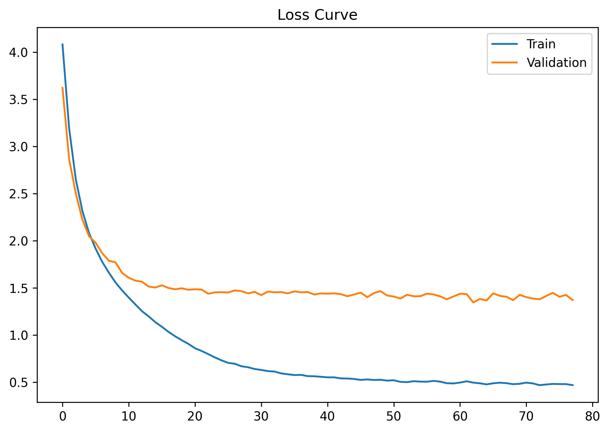

# **CIFAR-100 Image Classification with Inception-ResNet-v2**  
**Best Validation Accuracy: 75.7%**  

---

## **Project Overview**  
This project implements an **Inception-ResNet-v2 inspired architecture** for **CIFAR-100 image classification**. The model combines:  

| Component               | Implementation Details          | Benefit                          |
|-------------------------|----------------------------------|----------------------------------|
| **Inception Modules**   | Multi-scale feature extraction   | Captures patterns at different scales |
| **Residual Connections**| Skip connections in all blocks   | Improves gradient flow           |
| **Weight Standardization** | Replaces BatchNorm           | More stable training             |
| **Group Normalization** | 32 groups normalization         | Batch-size independent           |
| **Label Smoothing**     | ε=0.1 regularization            | Prevents overconfidence          |
| **Mixed-Precision (AMP)**| FP16 training with GradScaler  | Faster training, less memory     |

Optimized for **CIFAR-100** (32×32 images, 100 classes), the implementation includes **early stopping**, **cosine LR scheduling**, and **AdamW optimization**.

---

## **Model Architecture**  
A modified **Inception-ResNet-v2** adapted for CIFAR-100, featuring:  
- **Weight Standardized Convolutions** (no BatchNorm)  
- **Group Normalization** + **Pre-Activation** blocks  
- **Residual shortcuts** in all Inception modules  

➡️ **See full details**: [docs/model_architecture.md](docs/model_architecture.md)  

---

## **Training Details**  

### **Hyperparameters**  
| Parameter          | Value                     |  
|--------------------|---------------------------|  
| Batch Size         | 128                       |  
| Epochs             | 1000 (Early Stopping)     |  
| Learning Rate      | 1e-3 (Cosine Annealing)   |  
| Optimizer          | AdamW (Weight Decay=1e-3) |  
| Label Smoothing    | 0.05                      |  
| Early Stopping Patience | 15 epochs                 |  

### **Training Techniques**  
- **Mixed-Precision (AMP)** → Faster training with `autocast` + `GradScaler`.  
- **Cosine Annealing LR** → Smooth decay.  
- **Augmentations** → Random crops + flips.  

---

## **Results**  
- **Best Val Accuracy**: **75.7%**  
- **Training Time**: ~90 epochs (early stopping).  
- **Loss Curve**:  
    
- **Predictions**:  
   
---

### **Conclusion**  
This **Inception-ResNet-v2 variant** achieves **75.7% accuracy** on CIFAR-100 by:  
- Combining **Inception multi-scale processing** with **ResNet shortcuts**.  
- Using **GroupNorm + Weight Standardization** for stability.  
- Optimizing training with **AMP + AdamW**.  

---

**Reference**: 
- [Inception-ResNet-v2 Paper](https://arxiv.org/abs/1602.07261) | [Code](https://paperswithcode.com/method/inception-resnet-v2)
- [GroupNorm Paper (Wu & He, 2018)](https://arxiv.org/abs/1803.08494)  
- [Weight Standardization (Qiao et al., 2019)](https://arxiv.org/abs/1903.10520)  
- [Batch Size vs. Generalization (Keskar et al., 2017)](https://arxiv.org/abs/1609.04836)  
