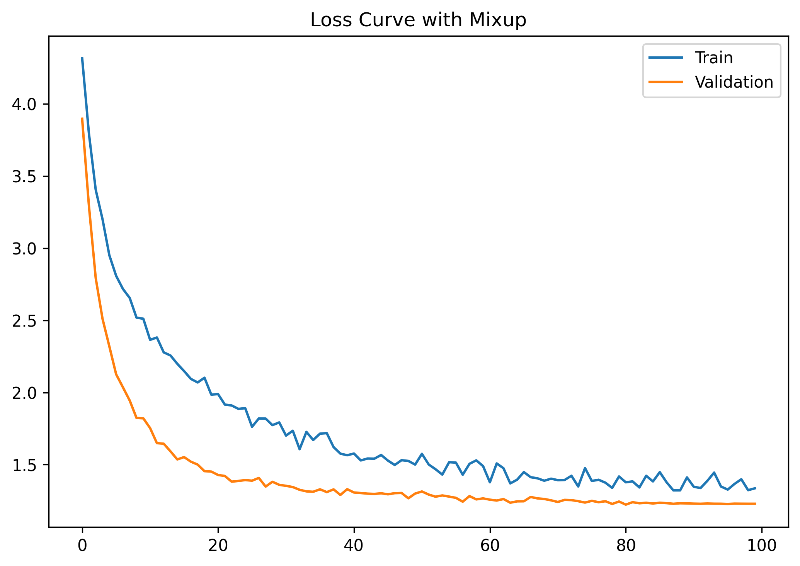

# **CIFAR-100 Image Classification with Inception-ResNet-v2**  
**Best Validation Accuracy: 79.12%** (Improved with MixUp Augmentation)  

---

## **Project Overview**  
This project implements an **Inception-ResNet-v2 inspired architecture** for **CIFAR-100 image classification**, comparing two key approaches:  

1. **Baseline Model** (No MixUp) → Reached **75.7% val accuracy** but showed overfitting  
2. **Improved Model** (With MixUp α=0.4) → Achieved **79.12% val accuracy** with better generalization  

Key components:  

| Component               | Implementation Details          | Benefit                          |
|-------------------------|----------------------------------|----------------------------------|
| **Inception Modules**   | Multi-scale feature extraction   | Captures patterns at different scales |
| **Residual Connections**| Skip connections in all blocks   | Improves gradient flow           |
| **Weight Standardization** | Replaces BatchNorm           | More stable training             |
| **Group Normalization** | 32 groups normalization         | Batch-size independent           |
| **Label Smoothing**     | ε=0.1 regularization            | Prevents overconfidence          |
| **Mixed-Precision (AMP)**| FP16 training with GradScaler  | Faster training, less memory     |
| **MixUp Augmentation**  | α=0.4 interpolation             | Regularization + Robustness      |

---

## **Model Architecture**  
A modified **Inception-ResNet-v2** adapted for CIFAR-100, featuring:  
- **Weight Standardized Convolutions** (no BatchNorm)  
- **Group Normalization** + **Pre-Activation** blocks  
- **Residual shortcuts** in all Inception modules  

➡️ **See full details**: [docs/model_architecture.md](docs/model_architecture.md)  

---

## **Training Details**  

### **Hyperparameters**  
| Parameter          | Value                     |  
|--------------------|---------------------------|  
| Batch Size         | 128                       |  
| Epochs             | 1000 (Early Stopping)     |  
| Learning Rate      | 1e-3 (Cosine Annealing)   |  
| Optimizer          | AdamW (Weight Decay=1e-3) |  
| Label Smoothing    | 0.05                      |  
| MixUp (α)         | 0.4                       |  
| Early Stopping Patience | 15 epochs                 |  

---

## **Results**
### **1. Baseline (No MixUp)**  
- **Best Val Accuracy**: 75.7%  
- **Issue**: Clear overfitting (training loss ↘ while val loss ↗)  
  

### **2. With MixUp (α=0.4)**  
- **Best Val Accuracy**: 79.12% (**+3.42% improvement**)  
- **Advantage**: Better aligned training/validation curves  
  

---
## **Key Findings**  
1. **MixUp's Regularization Effect**  
   - Reduces overfitting by enforcing linear behavior between samples  
   - Training loss now better predicts validation performance  

2. **Performance Gain**  
   

  | Model          | Val Acc | Train Time | Checkpoint | Generalization| 
  |---------------|---------|------------|------------|  --------------|
  | Baseline      | 75.7%   | 2.1 hrs    | `best_model.pth` | Overfitting | 
  | **+MixUp**    | **79.12%** | 2.4 hrs    | `best_model_mixup.pth` | Stable |

3. **Training Dynamics**  
   - MixUp slows initial convergence but improves final performance  
   - Requires ~10% more epochs to stabilize (compensated by early stopping)  

---

### **Key Improvements**  
1. **MixUp Augmentation (α=0.4)** → Linear interpolation of images/labels for better generalization.  
2. **Regularization Synergy** → Combined with Label Smoothing, reduces overfitting.  
3. **Stable Training** → Weight Standardization + GroupNorm prevents batch-size dependency.  

---

### **Recommended Usage:**  
```python
# For production/research:
model.load_state_dict(torch.load('saved_models/best_model_mixup.pth'))
```
--- 

## **Conclusion**  
This **Inception-ResNet-v2 variant** achieves **79.12% accuracy** on CIFAR-100 by:  
- Combining **Inception multi-scale processing** with **ResNet shortcuts**.  
- Using **GroupNorm + Weight Standardization** for stability.  
- **MixUp augmentation (α=0.4)** for robust feature learning.  
- Optimizing training with **AMP + AdamW + Cosine LR**.  

---

**References**:  
- [Inception-ResNet-v2 Paper](https://arxiv.org/abs/1602.07261)  
- [MixUp: Beyond Empirical Risk Minimization (Zhang et al., 2018)](https://arxiv.org/abs/1710.09412)  
- [GroupNorm Paper (Wu & He, 2018)](https://arxiv.org/abs/1803.08494)  
- [Weight Standardization (Qiao et al., 2019)](https://arxiv.org/abs/1903.10520)  


